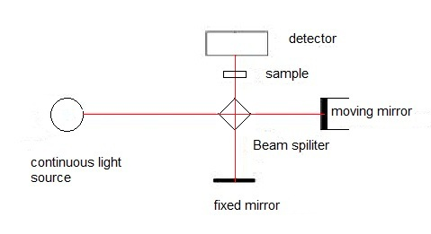

When two atoms combine to form a stable covalent moleculer, there are two repulsion forces acting between the two hetero atoms. One between the positively charged nuclei of both the atoms and the other between the negative electron clouds. The other force is the attraction between the nucleus of one atom with the electons of the other atom. Balancing the forces between them, the two atoms settle at a mean internuclear distance or the bond length where the total energy of the system is minimum. Any change like pulling the atoms away or squeezing them brings change in the bond length which requires an input of energy.

A diatomic molecule with the above description is considered as two vibrating masses that are connected by a spring. The internuclear distance between the atoms at energy minimum is referred to as the equilibrium distance (re)Any change in this distance is given by Hooke' law as:

f = -k(r-re)

where f is the restoring force and r is the bond length. The energy associated cinsidering the energy curve to be parobolic is given as :
E= 1/2k(r-re)2

For any haormonic oscillator, when the bond vibrates, its enrgy of vibration is changing continually and periodically from kinetic to potential enrgy and back again. The total energy is proportional to the frequency of vibration, and is given as:

Eosc = h¦Íosc

The elastic nature of the bond has an intrinsic vibrational frequency which is determined by the force constant K of the spring or its stiffness, the masses of the bonded atoms.

where c is the speed of light, and μ is the reduced mass of the system which is given by:

μ = m1m2/m1 + m2

The value of the force constant varies from bond to bond. K for a triple bond is three times those of a single bond and for a double bond it is twice those of a single bond. There are two significant features that can be drawn:

1. Strong bonds have large force constants and vibrate at a higher frequency than the weaker bonds.
2. Bonds between the heavy atoms (larger reduced mass) vibrate at a lower frequency than that of bonds between the lighter atoms.

**The Infrared Spectrometer:**
The infrared spectrometer or the spectrophotometer is the instrument that determines the IR absorption spectra of a compound. There are two types of spectrometers that are widely used in laboratories.
a. Dispersive infrared spectrometers
b. Fourier-Transform spectrometers

Figure 2: The main components of a fourier transform infrared (FTIR) spectrophotometer.
Picture source: [Fourier Transform Infrared Spectroscopy of Metal Ligand Complexes
](https://cnx.org/content/m34660/latest/?collection=col10699/latest)

FT-IR spectrometers are the modern spectometers that provide the spectrum more rapidly than the dispersive ones. The optical pathway produces a pattern called the interferogram. This is a complex signal which is a plot of intensity versus time. For more practical purposes this time-domine spectrum is converted to a frequency-domain spectrum, that is intensity versus frequency. This conversion is done by a mathematical operation called a Fourier-Transform (FT). FT separates the individual frequencies from the interferogram producing a virtual spectrum identical to the one abtained form dispersive spectrometers. The biggest advantage of using a FT-IR spectometers is that it is possible to collect number of interferograms of the same sample in less than a second. When a fourier-Transform is performed a sum of all the interferograms gives spectrum which has a better signal to noise ratio. Greater speed and greater sensitivity makes FT-IR spectrometers preferred over dispersive spectometers.

Figure 3: FT-IR spectrophotometers collects the interferograms of the sample and fourier-transform them to a absorption spectrum.
<!-- Takes to much time in Loading -->
<!-- Picture source: [Thermo Nicolet](https://faculty.sdmiramar.edu/fgarces/LabMatters/Instruments/FTIR/FTIR.htm)  -->

